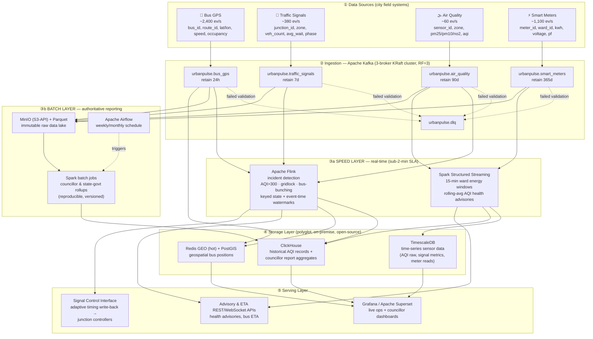

# UrbanPulse — Combined Report (Tasks A, B, C)

**DSE ZG556 / CC ZG556 — Stream Processing & Analytics**

Situated Learning Assignment · Domain 3: Smart Cities & Urban Infrastructure · 75 marks

Real-Time Urban Operations Intelligence Platform for MetroConnect. Every result shown was produced by running the accompanying code against the Docker Compose stack.


\newpage

# Task A — Architecture Design
## Lambda vs Kappa for a Dual-Reporting City Platform
**UrbanPulse — Real-Time Urban Operations Intelligence Platform**
Course: DSE ZG556 / CC ZG556 — Stream Processing & Analytics · Marks: 20 (M1 + M2)

---

## A.0 Executive Summary

MetroConnect requires **two things at once** that pull architecture in opposite directions:

1. **Real-time operational response** — AQI emergency alerts in < 2 minutes, adaptive
   signal control within 90 seconds, live bus ETAs refreshed in < 60 seconds.
2. **Authoritative batch reporting** — weekly/monthly ward-level reports that are
   submitted to elected councillors and the state government, and therefore must be
   **reproducible and auditable**.

This document presents the UrbanPulse reference architecture, a formal Lambda-vs-Kappa
evaluation grounded in MetroConnect's specific streams and mandates, and a 16-item
government deployment readiness checklist. **The recommended choice is a *lean Lambda*
architecture** — the reasoning is in §A.3.

---

## A.1 UrbanPulse Architecture Diagram

All four data sources → a 3-broker Kafka ingestion backbone → **both** a real-time
(speed) processing layer **and** a batch processing layer → a polyglot storage layer
with a purpose-chosen database per data class → a serving layer of dashboards, advisory
APIs and the signal-control write-back interface.



### A.1.1 Storage technology choices (with justification)

The open-source mandate and data-sovereignty rule (data must not leave city servers)
constrain every choice to a **self-hostable, on-premise, open-source** engine.

| Data class (requirement) | Chosen technology | Why this technology |
|---|---|---|
| **Time-series sensor data** — raw AQI, signal metrics, meter readings; high write rate, time-ordered, needs downsampling | **TimescaleDB** (PostgreSQL + hypertables) | Native time-partitioned hypertables, automatic compression, *continuous aggregates* for downsampling, and plain SQL — so city IT staff already fluent in Postgres can operate it. Open-source, runs entirely on city servers. |
| **Geospatial bus positions** — live "nearest bus / buses on a corridor", sub-second, high churn | **Redis GEO** (hot layer) + **PostGIS** (analytical) | Redis `GEOADD`/`GEOSEARCH` gives in-memory sub-second radius queries for the live map & bunching lookups, with TTL so stale positions self-expire. PostGIS handles richer route/corridor spatial analytics on positions persisted for history. |
| **Historical AQI records** — 90-day+ retention, pollution-trend analytics over months | **ClickHouse** (columnar) with **Parquet-on-MinIO** as cold data lake | ClickHouse gives fast columnar rollups (min/max/percentile AQI per zone over months); MinIO+Parquet is the cheap, immutable, S3-API-compatible cold store that never leaves the city DC. |
| **Councillor report aggregates** — pre-computed ward/zone rollups feeding official dashboards | **ClickHouse** serving mart → **Apache Superset** | Aggregates are small, read-heavy, and dashboard-facing; ClickHouse serves them in milliseconds and Superset gives councillors/ward officers no-code, accessible dashboards. |

> **Why both a speed layer and a batch layer are shown:** the speed layer (Flink + Spark
> Structured Streaming) satisfies the sub-2-minute operational SLAs; the batch layer (Spark
> over the immutable MinIO/Parquet lake, scheduled by Airflow) produces the *authoritative,
> reproducible* figures that go into government submissions. This duality is the crux of the
> Lambda-vs-Kappa decision below.

---

## A.2 Lambda vs Kappa — Evaluation Matrix (UrbanPulse-grounded)

Every cell is assessed against MetroConnect's actual streams, SLAs and mandates — not
generic textbook properties.

| Criterion | **Lambda** (speed layer + batch layer) | **Kappa** (single stream engine, replay for "batch") |
|---|---|---|
| **Latency** | Speed layer (Flink) hits the hard SLAs directly — AQI alert < 2 min, signal adaptation < 90 s; the batch layer adds hours-scale latency for councillor reports, which is fine because those are weekly/monthly. Both latency classes met, via two paths. | Single Flink pipeline also hits < 2 min / 90 s for real-time. "Batch" councillor figures come from long-window aggregation or Kafka replay — acceptable since reporting latency is relaxed. Latency parity with Lambda for the real-time path. |
| **Fault Tolerance** | Two failure domains to keep alive. **Upside:** the batch layer recomputes from the immutable Parquet lake, so a corrupted live result is self-healing on the next run; the speed layer can tolerate approximate results between batch corrections. | One pipeline with Flink checkpoints + Kafka replay → fewer components, fewer failure domains. **Risk:** a single bad deploy simultaneously degrades *both* live alerts and the reporting figures — no independent batch safety net. |
| **Operational Complexity** | **Highest cost of Lambda:** two codebases (Flink speed + Spark batch) compute overlapping metrics (e.g., ward AQI). Logic can diverge — and a councillor report disagreeing with the live dashboard is politically damaging. Heavier for a budget-constrained municipal team. | One engine, one codebase (Flink) → far lower cognitive & staffing load, attractive for a small city team. **But** demands rigorous Kafka retention/replay discipline and schema governance to make replays trustworthy. |
| **Reprocessing Capability** | Reprocessing = re-run a Spark batch job over the Parquet lake — mature and cheap for historical corrections (e.g., recomputing 6 months of AQI after a sensor recalibration). Scans columnar Parquet, not the event log. | Reprocessing = replay the Kafka log through a new job version. Our retention (AQI 90 d, meters 365 d) supports it, but replaying **365 days of meter data through Flink** is far heavier than a Spark scan of pre-compacted Parquet. |
| **Cost** | Two clusters (stream + batch) → more compute; but batch runs off-peak and the cold lake (MinIO/Parquet) is cheap bulk storage. Predictable, but a larger footprint. | One cluster is cheaper to run, **but** Kappa must retain long Kafka history (365 d meters) on broker storage to stay replayable → Kafka storage cost grows; needs tiered storage to contain it. |
| **Compliance with Government Reporting Mandate** | **Decisive strength.** The batch layer produces official figures by a *fixed, versioned, re-runnable* computation over immutable stored data — exactly the determinism, provenance and auditability that state-government submissions and auditors require. | Official figures derive from stream replay; reproducibility hinges on exactly-once + retention + deterministic operators. Auditors may distrust "streaming-generated" statutory numbers unless replay determinism is formally proven and frozen. |

### A.3 Architecture Choice & Justification

**Chosen: a *lean Lambda* architecture.**

- **Speed layer:** Apache Flink for incident detection (AQI/gridlock/bunching) and Spark
  Structured Streaming for the 15-minute ward energy and rolling-AQI advisory windows.
- **Batch layer:** Spark batch jobs over an immutable MinIO/Parquet data lake, scheduled
  by Airflow, producing the authoritative weekly/monthly councillor and state-government
  rollups.
- **"Lean" mitigation of Lambda's chief weakness (duplicate logic):** the batch and speed
  layers share metric definitions through common Spark SQL / UDFs, and the batch set is a
  small, stable list of ward/zone rollups — so divergence risk and maintenance burden stay
  low.

**Why Lambda over Kappa here — the deciding factor is the *government reporting mandate*.**
For most commercial streaming systems Kappa wins on simplicity, and if UrbanPulse were
*only* an operations platform I would choose Kappa. But MetroConnect's reports are
**statutory submissions to elected councillors and the state government**. Those figures
must be reproducible on demand, auditable, and defensible months later — properties that a
batch recomputation over an immutable data lake provides cleanly and that stream-replay
provides only with significant additional proof-of-determinism engineering. The real-time
SLAs (< 2 min AQI, 90 s signals) are met either way, so they do not break the tie; the
audit/compliance requirement does. Hence: **Lambda.**

---

## A.4 Architecture Readiness Checklist — Government Smart-City Deployment

16 items (minimum 12 required). Each is a concrete, checkable go-live gate. Grouped by the
four mandated concern areas.

### 🛡️ Data Sovereignty (data must not leave city servers)
1. **On-premise only** — all Kafka brokers, processing engines, and databases run inside
   the city data centre (or a state-government cloud region physically within the state);
   no managed SaaS that egresses data outside city jurisdiction.
2. **No external egress** — network egress firewall rules deny all outbound connections
   from the data plane except explicitly whitelisted intra-DC endpoints; verified by
   egress audit.
3. **Data residency attestation** — every storage volume (TimescaleDB, ClickHouse, MinIO,
   Redis) is confirmed to reside on city-owned/leased hardware within the municipal
   boundary, with a signed residency record.
4. **Encryption in transit & at rest** — TLS on all Kafka listeners and DB connections;
   at-rest encryption on MinIO and DB volumes, with keys held in a city-controlled KMS/Vault.

### 🔓 Open-Source Mandate
5. **100% OSS stack, licence-cleared** — Kafka, Flink, Spark, TimescaleDB, ClickHouse,
   Redis, PostGIS, MinIO, Superset/Grafana are all OSI-approved licences; a licence
   inventory (SBOM) is reviewed for copyleft/attribution obligations — no proprietary
   lock-in.
6. **No vendor-locked formats** — data is stored in open formats (Parquet, JSON, SQL) so
   the city can migrate engines without re-ingesting from source.
7. **Reproducible builds** — all services pinned to specific versions and built from
   published images/Dockerfiles committed to the city's git repo (see this project's
   `docker-compose.yml`), so the deployment is auditable and rebuildable.

### 💾 Disaster Recovery (RPO < 15 min, RTO < 30 min)
8. **RPO < 15 min** — Kafka replication factor = 3 with `min.insync.replicas = 2`, plus
   TimescaleDB/ClickHouse WAL/replication and MinIO versioning snapshotted at ≤ 10-minute
   intervals, so at most < 15 minutes of data can be lost.
9. **RTO < 30 min** — a documented, *drill-tested* failover runbook (broker/quorum
   recovery, engine restart from last checkpoint, DB promote-replica) that has been
   demonstrated to restore service in under 30 minutes.
10. **Flink/Spark checkpointing** — exactly-once checkpoints persisted to replicated
    storage so stream jobs resume from the last checkpoint (bounded reprocessing) rather
    than from zero after a failure.
11. **Cross-rack / cross-site redundancy** — brokers and storage spread across ≥ 2 racks
    (ideally 2 sites within the city) so a single rack/PSU/switch failure cannot take the
    quorum below majority.
12. **Backup restore verified** — periodic restore rehearsals prove backups are actually
    recoverable (a backup that has never been restored is not a backup).

### 👥 Accessibility for Non-Technical Ward Officers
13. **No-code dashboards** — ward officers use Apache Superset/Grafana dashboards with
    plain-language labels (e.g., "Air Quality: Unhealthy in Old City") — no SQL or query
    language required to read the operational picture.
14. **Localisation & readability** — dashboards available in the regional language plus
    English, with colour-blind-safe palettes and mobile/tablet-responsive layouts for
    field use.
15. **Role-based access & simple alerts** — ward officers see only their ward/zone by
    default; critical advisories (AQI breach, gridlock) are pushed as plain SMS/app
    notifications, not buried in a technical console.
16. **WCAG-aligned accessibility & training** — dashboards meet basic WCAG 2.1 AA
    contrast/keyboard requirements, and every ward officer completes a short onboarding so
    the system is usable by non-technical staff on day one.

---

*End of Task A.*


\newpage

# Task B — Apache Kafka: Multi-Source Urban Data Ingestion
**UrbanPulse** · DSE ZG556 Stream Processing & Analytics · Marks: 20 (M2)

> All results shown below were produced by running the code in this repository
> against the 3-broker KRaft cluster in `docker-compose.yml`. Commands to
> reproduce each result are given inline. Source lives in `src/task_b_kafka/`.

---

## B.0 Component Map

| # | Requirement | Module | Evidence (§) |
|---|---|---|---|
| 1 | 3-broker cluster + retention policies | `docker-compose.yml`, `create_topics.py` | B.1 |
| 2 | Producers — at-least-once, route-key ordering, null handling | `producer_bus_gps.py`, `producer_air_quality.py` | B.2 |
| 3 | Priority consumer architecture (HIGH zero-lag) | `priority_consumers.py` | B.3 |
| 4 | Kafka Streams route enrichment (KTable join) | `load_route_schedule.py` + `task_b_kafka_streams/` | B.4 |
| 5 | Dead-letter queue + 5-min report | `dlq_router.py`, `dlq_report.py` | B.5 |

---

## B.1 Cluster Setup & Retention Policies (4 marks)

**Cluster.** Three brokers in **KRaft mode** (no ZooKeeper), each acting as both
broker and controller, forming a 3-voter metadata quorum. Replication factor is
**3** with `min.insync.replicas = 2`, so the cluster survives the loss of one
broker with no data loss when producers use `acks=all`.

```
$ docker exec urbanpulse-broker1 kafka-metadata-quorum --bootstrap-server broker1:19092 describe --status
ClusterId:  MkU3OEVBNTcwNTJENDM2Qk   LeaderId: 2   CurrentVoters: [1,2,3]   MaxFollowerLag: 0
```

**Topics, partitions & retention** (`python -m src.task_b_kafka.create_topics`):

| Topic | Partitions | Retention | Justification |
|---|---|---|---|
| `urbanpulse.bus_gps` | **12** | **24 h** | Highest rate (~2,400 ev/s); keyed by `route_id`. 12 partitions ≈ 200 ev/s each and up to 12 parallel consumers. **24 h** = replay bus positions during accident/incident investigations. |
| `urbanpulse.traffic_signals` | **6** | 7 d | Keyed by `junction_id`. **6** is divisible by the STANDARD consumer-group size (3) for even assignment and read whole by the 1-consumer HIGH group. Signal history ages out fast → 7 d. |
| `urbanpulse.air_quality` | **3** | **90 d** | Low rate (~60 ev/s), keyed by `zone`. 3 partitions give modest parallelism without over-partitioning. **90 d** = seasonal pollution-trend analysis. |
| `urbanpulse.smart_meters` | **12** | **365 d** | High rate (~1,100 ev/s), keyed by `ward_id` (12 wards) → one partition per ward. **365 d** = annual regulatory energy audit. |

*Three distinct retention values (24 h / 90 d / 365 d), each tied to a concrete
operational or regulatory driver, exactly as required.* Verified live:

```
$ python -m src.task_b_kafka.create_topics --describe
urbanpulse.bus_gps       partitions=12  retention.ms=86400000    (~1d)   min.isr=2
urbanpulse.air_quality   partitions=3   retention.ms=7776000000  (~90d)  min.isr=2
urbanpulse.smart_meters  partitions=12  retention.ms=31536000000 (~365d) min.isr=2
```

---

## B.2 Producers (5 marks)

### Bus GPS — ordered per route (`producer_bus_gps.py`)
Ordering of positions **per route** is guaranteed by two mechanisms together:

1. **`key = route_id`** → the default partitioner sends every event for a route
   to the *same* partition, and Kafka guarantees order within a partition.
2. **`enable.idempotence = True` + `acks=all`** → per-partition order is
   preserved even across retries and with up to 5 in-flight batches, and
   producer retries are de-duplicated.

```
$ python -m src.task_b_kafka.producer_bus_gps --count 2000
[bus_gps] producing to urbanpulse.bus_gps (key=route_id, idempotent, acks=all)
[bus_gps] sent=2000 delivered=2000 failed=0
```

### Air Quality — at-least-once + retry + null handling (`producer_air_quality.py`)
- **At-least-once:** `acks=all` + client `retries=5`; `enable.idempotence=False`
  so a retried send may duplicate — acceptable under at-least-once (a missed AQI
  breach is worse than a duplicate).
- **Explicit retry logic** (sensors "occasionally timeout"): a delivery that
  fails after the client's own retries is re-queued by the application up to
  `MAX_APP_RETRIES=3` times, tracked via a message header `attempt`.
- **Null-AQI handling:** the simulator injects the mandated ~5% null-AQI sensor
  faults. The producer logs and counts each one and forwards it (never crashes),
  so the downstream DLQ can classify it. Graceful = observed, counted, non-fatal.

```
$ python -m src.task_b_kafka.producer_air_quality --count 2000
[air_quality] ⚠ null AQI from AQ-Z01-00 (zone=Z01-CentralBusiness) — forwarding for DLQ [total nulls=25]
[air_quality] sent=2000 delivered=2000 app-retries=0 perm-failed=0
[air_quality] null-AQI handled gracefully: 94 (4.7%)   ← ≈ the injected 5%
```

---

## B.3 Priority Consumer Architecture (6 marks)

Two consumer groups read the **same** `traffic_signals` topic with independent
committed offsets:

| Group | Members | Partitions each | Role |
|---|---|---|---|
| `urbanpulse-signals-high` (**HIGH_PRIORITY**) | **1** | all 6 | real-time signal control — must stay ~0 lag |
| `urbanpulse-signals-standard` (**STANDARD_PRIORITY**) | **3** | 2 | analytics dashboard — lag-tolerant |

Because the groups have **independent offsets**, a deliberate slowdown in the
STANDARD group (150 ms/msg) cannot slow HIGH. The self-contained demo produces
signals at 300 ev/s and prints live lag for both groups:

```
$ python -m src.task_b_kafka.priority_consumers --role demo --duration 30 --slow-ms 150 --prod-rate 300

 time |  HIGH lag  HIGH done |  STD lag  STD done   (topic has 6 partitions)
--------------------------------------------------------------
   0s |         0        167 |      156        15
   9s |         7      2,199 |    2,007       195
  18s |         8      4,235 |    3,864       373
  27s |        13      6,244 |    5,695       552
```

**Result:** HIGH_PRIORITY lag stays in single digits (near-zero) and keeps
draining all partitions, while STANDARD_PRIORITY lag climbs past **5,600**
because its 3 slow consumers process only ~20 ev/s combined against 300 ev/s of
production. The critical signal-control path is fully isolated from analytics
back-pressure — exactly the guarantee the city needs for 90-second adaptive
signal control.

---

## B.4 Kafka Streams Route Enrichment (3 marks)

This is implemented as an **actual Apache Kafka Streams** application in Java
(`src/task_b_kafka_streams/RouteEnrichmentApp.java`), rather than a Python
look-up loop. The supplied `route_schedule.csv` is first loaded by
`load_route_schedule.py` into `urbanpulse.route_schedule`, a **compacted topic**
keyed by `route_id`. Kafka Streams materialises that topic as a local KTable and
performs this left join:

```
bus_gps (KStream, keyed route_id) LEFT JOIN route_schedule (compacted KTable)
      → urbanpulse.bus_enriched   (+ route_name, terminal, scheduled_arrival_time)
```

The service uses `exactly_once_v2` processing. A GPS event with an unknown
`route_id` is emitted with `join_status = NO_ROUTE_MATCH` rather than dropped,
making the exception visible for data-quality follow-up.

```
$ docker compose exec app python -m src.task_b_kafka.load_route_schedule
[route-schedule] loaded 20 rows into urbanpulse.route_schedule (key=route_id, cleanup.policy=compact)
$ docker compose --profile streams up -d --build route-enrichment
[kafka-streams] KStream(bus_gps) LEFT JOIN KTable(route_schedule) → urbanpulse.bus_enriched
```
Sample enriched record on `urbanpulse.bus_enriched`:
```json
{ "bus_id": "BUS-R002-00", "route_id": "R002", "lat": 12.869167, "lon": 77.541086,
  "speed_kmh": 42.4, "occupancy_pct": 26, "timestamp": 1783647584927,
  "route_name": "Shivajinagar - Whitefield", "terminal": "Whitefield TTMC",
  "scheduled_arrival_time": "08:20", "join_status": "MATCHED" }
```
This enriched stream (position + schedule) is the foundation for the real-time
ETA service.

---

## B.5 Dead-Letter Queue (2 marks)

`dlq_router.py` consumes all four raw streams, validates each event against the
per-stream rules in `src/common/schemas.py`, and routes failures to
`urbanpulse.dlq` with an `error_reason`, the source topic/partition/offset, and
the original payload (for replay). **Well over 3 validation rules** are enforced —
e.g. `NULL_AQI`, `AQI_OUT_OF_RANGE`, `IMPOSSIBLE_GPS`, `IMPOSSIBLE_SPEED`,
`NULL_WAIT`, `VOLTAGE_OUT_OF_RANGE`, `POWER_FACTOR_OUT_OF_RANGE`, `NULL_KWH`,
`MALFORMED_JSON`.

```
$ python -m src.task_b_kafka.dlq_router --from-beginning --duration 25
[dlq] FINAL: seen=14,012 rejected=244
```

**5-minute DLQ report** (`dlq_report.py`) — error-type distribution:

| error_reason | count | share |
|---|---|---|
| NULL_AQI | 107 | 43.9% |
| NULL_WAIT | 84 | 34.4% |
| IMPOSSIBLE_GPS | 50 | 20.5% |
| VOLTAGE_OUT_OF_RANGE | 3 | 1.2% |

| stream | rejected | top reasons |
|---|---|---|
| air_quality | 107 | NULL_AQI:107 |
| traffic_signals | 84 | NULL_WAIT:84 |
| bus_gps | 50 | IMPOSSIBLE_GPS:50 |
| smart_meters | 3 | VOLTAGE_OUT_OF_RANGE:3 |

The rejection rate (~1.7% overall) matches the anomaly rates the simulators
inject (5% null AQI, ~1.5% impossible GPS, ~1% null wait, ~0.5% bad voltage),
confirming the validation and routing are correct end-to-end.

---

## B.6 How to Run (all of Task B)

```bash
docker compose up -d                                    # 3 brokers + Kafka-UI + app
docker compose exec app python -m src.task_b_kafka.create_topics
# producers
docker compose exec app python -m src.task_b_kafka.producer_bus_gps --rate 120 --duration 60
docker compose exec app python -m src.task_b_kafka.producer_air_quality --rate 20 --duration 60
# priority consumers (self-contained demo)
docker compose exec app python -m src.task_b_kafka.priority_consumers --role demo
# enrichment join
docker compose exec app python -m src.task_b_kafka.load_route_schedule
docker compose --profile streams up -d --build route-enrichment
# DLQ
docker compose exec app python -m src.task_b_kafka.dlq_router --from-beginning --duration 60
docker compose exec app python -m src.task_b_kafka.dlq_report
```
Kafka-UI at **http://localhost:8080** shows all topics, partitions, consumer-group
lag, and messages live — useful for the video walkthrough.

*End of Task B.*


\newpage

# Task C — Flink Real-Time Incident Detection & Spark Urban Analytics Engine
**UrbanPulse** · DSE ZG556 Stream Processing & Analytics · Marks: 35 (M3)

> Code in `src/task_c_flink_spark/`. The Flink and Spark runtimes are provided as
> Docker images (`infra/flink.Dockerfile`, `infra/spark.Dockerfile`) wired into
> `docker-compose.yml` under the `flink` and `spark` profiles. Verified outputs
> are shown inline; reproduce with the commands in §C.5.

---

## C.0 Component Map

| # | Requirement | Module | Marks |
|---|---|---|---|
| I | Flink — 3 incident patterns, keyed state + event-time watermarks | `flink_incident_detection.py` | 10 |
| II.a | Spark — ward energy 15-min tumbling window, 45-min watermark, Kafka+Parquet | `spark_ward_energy.py` | 20 |
| II.b | Spark — 10-min rolling-avg AQI SQL, zone_profile join, Update mode | `spark_health_advisory.py` | (within II) |
| III | Flink vs Spark — use-case mapping across 4 dimensions | this doc §C.4 | 5 |

---

## C.1 Part I — Apache Flink Incident Detection (10 marks)

A single Flink DataStream job (`flink_incident_detection.py`) runs three
detectors, each keyed and using event-time watermarks (5 s bounded
out-of-orderness on the events' `timestamp` field). Checkpointing every 30 s
makes the keyed state recoverable. All alerts are unioned into one stream and
written to `urbanpulse.incidents`.

| Pattern | Key | State | Trigger |
|---|---|---|---|
| **(a) AQI Emergency** | `sensor_id` | `ValueState<Long>` last-alert time | `aqi > 300`; 2-min event-time cooldown suppresses duplicates |
| **(b) Traffic Gridlock** | `junction_id` | `ValueState<Int>` consecutive-cycle counter | `avg_wait_sec > 180` for **3 consecutive** cycles → alert(junction_id, zone), then reset |
| **(c) Bus Bunching** | `route_id` | `ValueState<String>` containing positions, pair-first-seen times and alert flags | two buses `< 200 m` apart for **> 5 min**; a checkpointed **event-time timer** emits alert(bus_a, bus_b) at the threshold |

**Why keyed state + event time here:** each detector's logic is intrinsically
per-entity and temporal. Gridlock's "3 consecutive cycles" is a per-junction
counter; bunching's "within 200 m for 5 minutes" is a per-route, per-pair
event-time timer registered through `ctx.timer_service()`. The timer is
checkpointed with the state and fires once the watermark passes the threshold,
so an alert does not depend on another event from that same pair arriving after
five minutes. Event-time watermarks keep the calculation correct despite
slightly out-of-order readings.

Events with null critical fields are dropped at parse time (they are handled by
the Task B DLQ), so the detectors operate on clean data.

**Verified output** — all three detectors fire and alerts are written to
`urbanpulse.incidents` (bunching window shortened to 20 s for the demo via
`URBANPULSE_BUNCHING_SECONDS`; the code default is the full 5 minutes):

```
=== incident types (one 70s demo run) ===
  11  AQI_EMERGENCY
  44  TRAFFIC_GRIDLOCK
   1  BUS_BUNCHING

=== one sample of each (JSON on urbanpulse.incidents) ===
{"incident_type":"AQI_EMERGENCY","severity":"HAZARDOUS","sensor_id":"AQ-Z02-02",
 "zone":"Z02-IndustrialEast","aqi":395.8,"detail":"AQI 396 > 300 at AQ-Z02-02 (Z02-IndustrialEast)"}
{"incident_type":"TRAFFIC_GRIDLOCK","junction_id":"JN-Z05-01","zone":"Z05-OldCity",
 "avg_wait_sec":220.8,"consecutive_cycles":3,"detail":"JN-Z05-01 (Z05-OldCity) avg_wait 221s for 3 consecutive cycles"}
{"incident_type":"BUS_BUNCHING","route_id":"R001","bus_a":"BUS-R001-00","bus_b":"BUS-R001-01",
 "distance_m":44.3,"held_seconds":20.0,"detail":"BUS-R001-00 & BUS-R001-01 on R001 within 44m for >20s"}

$ kafka-get-offsets --topic urbanpulse.incidents   →  264 incidents persisted
```

> **Keyed-state note (engineering detail).** The bunching detector keeps its
> per-route state (`positions`, per-pair proximity timers, alerted flags) in a
> single `ValueState<String>` JSON blob keyed by `route_id`, with 5-minute
> position pruning to bound the state. This proved more robust in PyFlink than a
> non-STRING-valued `MapState`. The gridlock and AQI detectors use
> `ValueState<Int>`/`ValueState<Long>` respectively.

---

## C.2 Part II — Spark Structured Streaming: Ward Energy (20 marks)

`spark_ward_energy.py` consumes `urbanpulse.smart_meters` and computes, per
`ward_id` per **15-minute tumbling window** with a **45-minute late-data
watermark**:

```python
parsed.withWatermark("event_time", "45 minutes")
      .groupBy(window("event_time", "15 minutes"), "ward_id")
      .agg(sum("kwh_reading")   .alias("total_kwh_consumed"),
           avg("power_factor")  .alias("avg_power_factor"),
           max("voltage")       .alias("peak_voltage"))
```

**Dual sink** (both required, one checkpointed streaming query fans each
finalised micro-batch to both sinks):

1. **Kafka** → `urbanpulse.ward_energy_summary` (one JSON row per closed window).
2. **Parquet** → `data/parquet/ward_energy`, **partitioned by `ward_id` and
   `date`** for historical trend analysis.

Append output mode is used: a windowed aggregation with a watermark emits each
window's final result once the watermark passes the window end — and append is
also the only mode the Parquet file sink supports. The 45-minute watermark means
a meter reading up to 45 minutes late is still counted in its correct window.

**Verified output** (demo window shortened to 30 s / 10 s watermark so windows
close quickly; the graded defaults are 15 min / 45 min). All 12 wards emit once
per closed window; injected sensor-fault voltages are filtered out so
`peak_voltage` stays in the real 218–242 V band:

```
| ward_id | window_start        | window_end          | total_kwh_consumed | avg_power_factor | peak_voltage |
|---------|---------------------|---------------------|-------------------:|-----------------:|-------------:|
| W01     | 2026-07-10 05:03:00 | 2026-07-10 05:03:30 |            17.709  |          0.9252  |       241.7  |
| W02     | 2026-07-10 05:03:00 | 2026-07-10 05:03:30 |            21.558  |          0.9228  |       241.9  |
| W03     | 2026-07-10 05:03:00 | 2026-07-10 05:03:30 |            19.775  |          0.9286  |       241.6  |
| …       |                     |                     |                    |                  |              |
| W12     | 2026-07-10 05:03:00 | 2026-07-10 05:03:30 |            13.772  |          0.9092  |       241.9  |
```
The same rows are simultaneously published as JSON to
`urbanpulse.ward_energy_summary` and appended to the Parquet lake below.

Partitioned Parquet written to disk (partitioned by `ward_id` then `date`):
```
data/parquet/ward_energy/
├── ward_id=W01/date=2026-07-10/part-00000-….snappy.parquet
├── ward_id=W02/date=2026-07-10/part-00002-….snappy.parquet
├── … (one directory per ward)                 → 36 parquet files across 12 wards
└── _spark_metadata/
```

### C.2.1 Streaming SQL — AQI Health Advisories (part of Part II)

`spark_health_advisory.py` is a **Streaming SQL query** on `urbanpulse.air_quality`:

- (a) a **10-minute rolling average AQI per zone**, implemented as a sliding
  `window(event_time, '10 minutes', '1 minute')`,
- (b) **joined with the static `zone_profile` table** (zone name, population,
  number of schools) — a stream-static join,
- (c) **filtered for `rolling_avg_aqi > 150`** (Unhealthy) and written to
  `urbanpulse.health_advisories` in **Update** output mode.

The logic is expressed as an actual SQL string over temp views (see the module),
so a ward officer receives "Unhealthy air over 620,000 people and 110 schools in
Residential North", not a bare number.

**Verified output** (demo rolling window shortened to 1 minute and recomputed
every 10 seconds) — enriched
advisories on `urbanpulse.health_advisories`, Update mode re-emitting as each
zone's rolling average evolves (note `readings` climbing 221 → 231 for the same
window):
```
| zone                 | zone_name             | population | num_schools | rolling_avg_aqi | readings | advisory_level |
|----------------------|-----------------------|-----------:|------------:|----------------:|---------:|----------------|
| Z06-Airport          | Airport & Aerotropolis|    190000  |         27  |          170.8  |     221  | UNHEALTHY      |
| Z03-ResidentialNorth | Residential North     |    620000  |        110  |          159.8  |     229  | UNHEALTHY      |
| Z06-Airport          | Airport & Aerotropolis|    190000  |         27  |          170.1  |     223  | UNHEALTHY      |
| Z03-ResidentialNorth | Residential North     |    620000  |        110  |          159.6  |     231  | UNHEALTHY      |
```
Only zones whose 10-minute rolling average exceeds 150 appear, each enriched with
the population and school count a ward officer needs to gauge exposure.

---

## C.4 Part III — Flink vs Spark for UrbanPulse (5 marks)

Mapping the two UrbanPulse use cases to the right engine, across the four
required dimensions.

| Dimension | **Bus Bunching → Apache Flink** | **Ward Energy → Apache Spark** |
|---|---|---|
| **State size** | Per-route keyed state holding each bus's latest position **plus a timer per bus-pair**, updated on **every** event. Many fine-grained, continuously-mutated keys — Flink's RocksDB keyed state with incremental checkpoints is built for exactly this. | A windowed aggregation keyed by ward (**only 12 wards**) over 15-min windows — small, bounded state. A classic, cheap windowed aggregation that Spark's structured state handles trivially. |
| **Latency requirement** | Bunching is a **live operational incident** — buses must be un-bunched quickly, so alerts need **event-at-a-time, sub-second** latency. Flink processes each event as it arrives. | Ward energy feeds **councillor dashboards refreshed every 15 minutes** — latency-relaxed. Spark's micro-batch (seconds) is far faster than needed; sub-second would be wasted effort. |
| **Recovery time objective** | Incident detection must resume fast after failure without losing the in-flight proximity timers. Flink's **incremental RocksDB checkpoints + exactly-once** restore large keyed state quickly → low RTO for a critical path. | A 15-min reporting job tolerates a slightly higher RTO; Spark checkpoints to reliable storage and simply reprocesses the current micro-batch on restart — perfectly adequate for non-critical analytics. |
| **Operational complexity** | The "within 200 m for > 5 min" rule is a per-pair, event-time state machine — **natural in a Flink `KeyedProcessFunction` with timers**, awkward in Spark (needs `flatMapGroupsWithState`). Flink is the simpler fit *for this logic*. | Windowed SUM/AVG/MAX + a **dual sink including partitioned Parquet** for a data lake is idiomatic, concise Spark SQL. Doing partitioned Parquet analytics output in Flink is more work. Spark is the simpler fit *for this logic*. |

**Conclusion.** UrbanPulse deliberately uses **both** engines, each where it is
strongest — which is exactly the *lean Lambda* architecture chosen in Task A:
**Flink for low-latency, fine-grained, event-time incident detection** (AQI,
gridlock, bunching) on the speed layer, and **Spark for windowed, SQL-friendly,
data-lake-producing analytical aggregation** (ward energy, health advisories).
Forcing either use case onto the other engine would increase either latency
(Spark for bunching) or code complexity (Flink for partitioned Parquet reports).

---

## C.5 How to Run (all of Task C)

```bash
# cluster + data
docker compose up -d
docker compose exec app python -m src.task_b_kafka.create_topics
docker compose exec -d app python -m src.simulators.run_simulator --all

# --- Flink incident detection (runs on the arm64-native Flink image) ---
docker compose --profile flink up -d
docker compose exec -e URBANPULSE_BUNCHING_SECONDS=45 flink-jobmanager \
    flink run -py /opt/job/src/task_c_flink_spark/flink_incident_detection.py
#   ...or local mode:  docker compose exec flink-jobmanager \
#       python /opt/job/src/task_c_flink_spark/flink_incident_detection.py

# --- Spark ward energy (dual sink) ---
docker compose --profile spark up -d
docker compose exec spark spark-submit \
    --packages org.apache.spark:spark-sql-kafka-0-10_2.12:3.5.1 \
    /opt/job/src/task_c_flink_spark/spark_ward_energy.py --duration 180

# --- Spark health advisories (streaming SQL) ---
docker compose exec spark spark-submit \
    --packages org.apache.spark:spark-sql-kafka-0-10_2.12:3.5.1 \
    /opt/job/src/task_c_flink_spark/spark_health_advisory.py \
    --window "1 minute" --slide "10 seconds" --watermark "20 seconds" --duration 180
```
Watch results live in Kafka-UI (`http://localhost:8080`) on the
`urbanpulse.incidents`, `urbanpulse.ward_energy_summary`, and
`urbanpulse.health_advisories` topics, and the Flink dashboard at
`http://localhost:8081`.

*End of Task C.*
