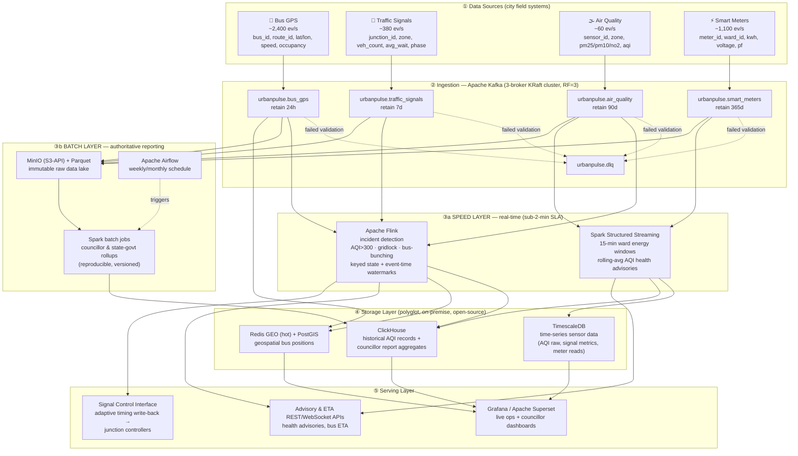

# Task A — Architecture Design
## Lambda vs Kappa for a Dual-Reporting City Platform
**UrbanPulse — Real-Time Urban Operations Intelligence Platform**
Course: DSE ZG556 / CC ZG556 — Stream Processing & Analytics · Marks: 20 (M1 + M2)

---

## A.0 Executive Summary

MetroConnect requires **two things at once** that pull architecture in opposite directions:

1. **Real-time operational response** — AQI emergency alerts in < 2 minutes, adaptive
   signal control within 90 seconds, live bus ETAs refreshed in < 60 seconds.
2. **Authoritative batch reporting** — weekly/monthly ward-level reports that are
   submitted to elected councillors and the state government, and therefore must be
   **reproducible and auditable**.

This document presents the UrbanPulse reference architecture, a formal Lambda-vs-Kappa
evaluation grounded in MetroConnect's specific streams and mandates, and a 16-item
government deployment readiness checklist. **The recommended choice is a *lean Lambda*
architecture** — the reasoning is in §A.3.

---

## A.1 UrbanPulse Architecture Diagram

All four data sources → a 3-broker Kafka ingestion backbone → **both** a real-time
(speed) processing layer **and** a batch processing layer → a polyglot storage layer
with a purpose-chosen database per data class → a serving layer of dashboards, advisory
APIs and the signal-control write-back interface.

### A.1.1 Storage technology choices (with justification)

The open-source mandate and data-sovereignty rule (data must not leave city servers)
constrain every choice to a **self-hostable, on-premise, open-source** engine.

| Data class (requirement) | Chosen technology | Why this technology |
|---|---|---|
| **Time-series sensor data** — raw AQI, signal metrics, meter readings; high write rate, time-ordered, needs downsampling | **TimescaleDB** (PostgreSQL + hypertables) | Native time-partitioned hypertables, automatic compression, *continuous aggregates* for downsampling, and plain SQL — so city IT staff already fluent in Postgres can operate it. Open-source, runs entirely on city servers. |
| **Geospatial bus positions** — live "nearest bus / buses on a corridor", sub-second, high churn | **Redis GEO** (hot layer) + **PostGIS** (analytical) | Redis `GEOADD`/`GEOSEARCH` gives in-memory sub-second radius queries for the live map & bunching lookups, with TTL so stale positions self-expire. PostGIS handles richer route/corridor spatial analytics on positions persisted for history. |
| **Historical AQI records** — 90-day+ retention, pollution-trend analytics over months | **ClickHouse** (columnar) with **Parquet-on-MinIO** as cold data lake | ClickHouse gives fast columnar rollups (min/max/percentile AQI per zone over months); MinIO+Parquet is the cheap, immutable, S3-API-compatible cold store that never leaves the city DC. |
| **Councillor report aggregates** — pre-computed ward/zone rollups feeding official dashboards | **ClickHouse** serving mart → **Apache Superset** | Aggregates are small, read-heavy, and dashboard-facing; ClickHouse serves them in milliseconds and Superset gives councillors/ward officers no-code, accessible dashboards. |

> **Why both a speed layer and a batch layer are shown:** the speed layer (Flink + Spark
> Structured Streaming) satisfies the sub-2-minute operational SLAs; the batch layer (Spark
> over the immutable MinIO/Parquet lake, scheduled by Airflow) produces the *authoritative,
> reproducible* figures that go into government submissions. This duality is the crux of the
> Lambda-vs-Kappa decision below.

---

## A.2 Lambda vs Kappa — Evaluation Matrix (UrbanPulse-grounded)

Every cell is assessed against MetroConnect's actual streams, SLAs and mandates — not
generic textbook properties.

| Criterion | **Lambda** (speed layer + batch layer) | **Kappa** (single stream engine, replay for "batch") |
|---|---|---|
| **Latency** | Speed layer (Flink) hits the hard SLAs directly — AQI alert < 2 min, signal adaptation < 90 s; the batch layer adds hours-scale latency for councillor reports, which is fine because those are weekly/monthly. Both latency classes met, via two paths. | Single Flink pipeline also hits < 2 min / 90 s for real-time. "Batch" councillor figures come from long-window aggregation or Kafka replay — acceptable since reporting latency is relaxed. Latency parity with Lambda for the real-time path. |
| **Fault Tolerance** | Two failure domains to keep alive. **Upside:** the batch layer recomputes from the immutable Parquet lake, so a corrupted live result is self-healing on the next run; the speed layer can tolerate approximate results between batch corrections. | One pipeline with Flink checkpoints + Kafka replay → fewer components, fewer failure domains. **Risk:** a single bad deploy simultaneously degrades *both* live alerts and the reporting figures — no independent batch safety net. |
| **Operational Complexity** | **Highest cost of Lambda:** two codebases (Flink speed + Spark batch) compute overlapping metrics (e.g., ward AQI). Logic can diverge — and a councillor report disagreeing with the live dashboard is politically damaging. Heavier for a budget-constrained municipal team. | One engine, one codebase (Flink) → far lower cognitive & staffing load, attractive for a small city team. **But** demands rigorous Kafka retention/replay discipline and schema governance to make replays trustworthy. |
| **Reprocessing Capability** | Reprocessing = re-run a Spark batch job over the Parquet lake — mature and cheap for historical corrections (e.g., recomputing 6 months of AQI after a sensor recalibration). Scans columnar Parquet, not the event log. | Reprocessing = replay the Kafka log through a new job version. Our retention (AQI 90 d, meters 365 d) supports it, but replaying **365 days of meter data through Flink** is far heavier than a Spark scan of pre-compacted Parquet. |
| **Cost** | Two clusters (stream + batch) → more compute; but batch runs off-peak and the cold lake (MinIO/Parquet) is cheap bulk storage. Predictable, but a larger footprint. | One cluster is cheaper to run, **but** Kappa must retain long Kafka history (365 d meters) on broker storage to stay replayable → Kafka storage cost grows; needs tiered storage to contain it. |
| **Compliance with Government Reporting Mandate** | **Decisive strength.** The batch layer produces official figures by a *fixed, versioned, re-runnable* computation over immutable stored data — exactly the determinism, provenance and auditability that state-government submissions and auditors require. | Official figures derive from stream replay; reproducibility hinges on exactly-once + retention + deterministic operators. Auditors may distrust "streaming-generated" statutory numbers unless replay determinism is formally proven and frozen. |

### A.3 Architecture Choice & Justification

**Chosen: a *lean Lambda* architecture.**

- **Speed layer:** Apache Flink for incident detection (AQI/gridlock/bunching) and Spark
  Structured Streaming for the 15-minute ward energy and rolling-AQI advisory windows.
- **Batch layer:** Spark batch jobs over an immutable MinIO/Parquet data lake, scheduled
  by Airflow, producing the authoritative weekly/monthly councillor and state-government
  rollups.
- **"Lean" mitigation of Lambda's chief weakness (duplicate logic):** the batch and speed
  layers share metric definitions through common Spark SQL / UDFs, and the batch set is a
  small, stable list of ward/zone rollups — so divergence risk and maintenance burden stay
  low.

**Why Lambda over Kappa here — the deciding factor is the *government reporting mandate*.**
For most commercial streaming systems Kappa wins on simplicity, and if UrbanPulse were
*only* an operations platform I would choose Kappa. But MetroConnect's reports are
**statutory submissions to elected councillors and the state government**. Those figures
must be reproducible on demand, auditable, and defensible months later — properties that a
batch recomputation over an immutable data lake provides cleanly and that stream-replay
provides only with significant additional proof-of-determinism engineering. The real-time
SLAs (< 2 min AQI, 90 s signals) are met either way, so they do not break the tie; the
audit/compliance requirement does. Hence: **Lambda.**

---

## A.4 Architecture Readiness Checklist — Government Smart-City Deployment

16 items (minimum 12 required). Each is a concrete, checkable go-live gate. Grouped by the
four mandated concern areas.

### 🛡️ Data Sovereignty (data must not leave city servers)
1. **On-premise only** — all Kafka brokers, processing engines, and databases run inside
   the city data centre (or a state-government cloud region physically within the state);
   no managed SaaS that egresses data outside city jurisdiction.
2. **No external egress** — network egress firewall rules deny all outbound connections
   from the data plane except explicitly whitelisted intra-DC endpoints; verified by
   egress audit.
3. **Data residency attestation** — every storage volume (TimescaleDB, ClickHouse, MinIO,
   Redis) is confirmed to reside on city-owned/leased hardware within the municipal
   boundary, with a signed residency record.
4. **Encryption in transit & at rest** — TLS on all Kafka listeners and DB connections;
   at-rest encryption on MinIO and DB volumes, with keys held in a city-controlled KMS/Vault.

### 🔓 Open-Source Mandate
5. **100% OSS stack, licence-cleared** — Kafka, Flink, Spark, TimescaleDB, ClickHouse,
   Redis, PostGIS, MinIO, Superset/Grafana are all OSI-approved licences; a licence
   inventory (SBOM) is reviewed for copyleft/attribution obligations — no proprietary
   lock-in.
6. **No vendor-locked formats** — data is stored in open formats (Parquet, JSON, SQL) so
   the city can migrate engines without re-ingesting from source.
7. **Reproducible builds** — all services pinned to specific versions and built from
   published images/Dockerfiles committed to the city's git repo (see this project's
   `docker-compose.yml`), so the deployment is auditable and rebuildable.

### 💾 Disaster Recovery (RPO < 15 min, RTO < 30 min)
8. **RPO < 15 min** — Kafka replication factor = 3 with `min.insync.replicas = 2`, plus
   TimescaleDB/ClickHouse WAL/replication and MinIO versioning snapshotted at ≤ 10-minute
   intervals, so at most < 15 minutes of data can be lost.
9. **RTO < 30 min** — a documented, *drill-tested* failover runbook (broker/quorum
   recovery, engine restart from last checkpoint, DB promote-replica) that has been
   demonstrated to restore service in under 30 minutes.
10. **Flink/Spark checkpointing** — exactly-once checkpoints persisted to replicated
    storage so stream jobs resume from the last checkpoint (bounded reprocessing) rather
    than from zero after a failure.
11. **Cross-rack / cross-site redundancy** — brokers and storage spread across ≥ 2 racks
    (ideally 2 sites within the city) so a single rack/PSU/switch failure cannot take the
    quorum below majority.
12. **Backup restore verified** — periodic restore rehearsals prove backups are actually
    recoverable (a backup that has never been restored is not a backup).

### 👥 Accessibility for Non-Technical Ward Officers
13. **No-code dashboards** — ward officers use Apache Superset/Grafana dashboards with
    plain-language labels (e.g., "Air Quality: Unhealthy in Old City") — no SQL or query
    language required to read the operational picture.
14. **Localisation & readability** — dashboards available in the regional language plus
    English, with colour-blind-safe palettes and mobile/tablet-responsive layouts for
    field use.
15. **Role-based access & simple alerts** — ward officers see only their ward/zone by
    default; critical advisories (AQI breach, gridlock) are pushed as plain SMS/app
    notifications, not buried in a technical console.
16. **WCAG-aligned accessibility & training** — dashboards meet basic WCAG 2.1 AA
    contrast/keyboard requirements, and every ward officer completes a short onboarding so
    the system is usable by non-technical staff on day one.

---

*End of Task A.*
